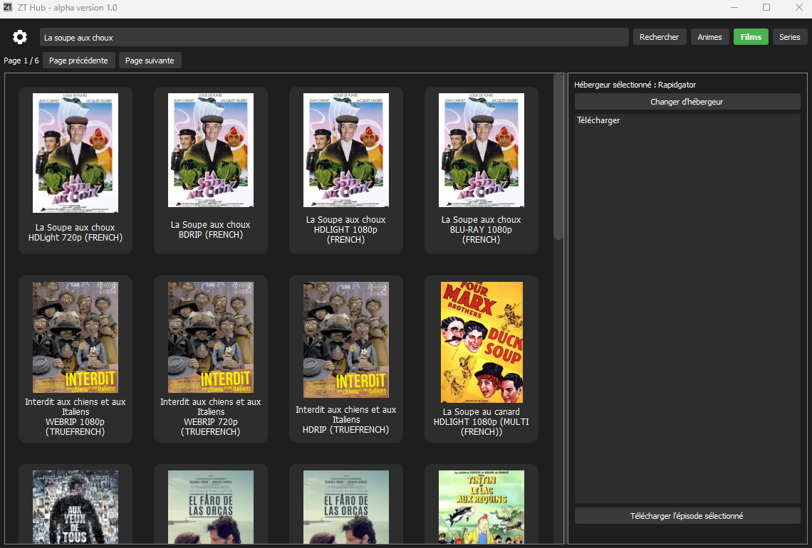

# ZT-Hub

ZT-Hub est une application de bureau entièrement développée en Python qui permet d'utiliser Zone-Téléchargement avec une interface utilisateur intuitive et sans publicités.

## Fonctionnalités

- Interface utilisateur simple et épurée
- Accès à Zone-Téléchargement sans publicités
- Intégration avec AllDebrid pour des téléchargements rapides et sécurisés

## Installation

1. Téléchargez la dernière version de l'application depuis la section [Releases].
2. Décompressez l'archive `ZT_Hub_vx.x.x.rar`.
3. Accédez au dossier `ZT_Hub` et lancez le fichier `ZT_Hub.exe`.
4. Vous pouvez également créer un raccourci vers l'application pour un accès plus facile.

## Configuration
1. Configurez votre DNS en [1.1.1.1](https://one.one.one.one/fr-FR/dns/), en effet zone-téléchargement est bloqué sur la plupart des FAI par DNS.
2. Après avoir lancé l'application, cliquez sur l'icône en forme de rouage en haut à gauche pour accéder aux paramètres.
3. Indiquez votre clé API AllDebrid :
   - Si vous n'avez pas de clé API, rendez-vous sur [alldebrid.fr](https://alldebrid.fr) et connectez-vous à votre compte premium.
   - Allez dans la section APIKEYS et créez une nouvelle clé API.
   - Entrez cette clé dans l'application ZT-Hub.

## Utilisation

1. Une fois la clé API configurée, l'application est prête à l'emploi.
2. Saisissez le nom d'une œuvre dans le champ de recherche.
3. Choisissez la catégorie appropriée.
4. Lancez la recherche et les résultats s'afficheront.
5. La liste des épisodes s'affiche sur la droite (Un lien unique pour un film).

## Note Légale

Le téléchargement direct n'est légal que si vous possédez une copie de l'original. Assurez-vous de respecter les lois sur le droit d'auteur de votre pays.

---

Ce projet est uniquement à des fins éducatives et de démonstration. Nous ne soutenons ni ne promouvons le piratage sous aucune forme.

