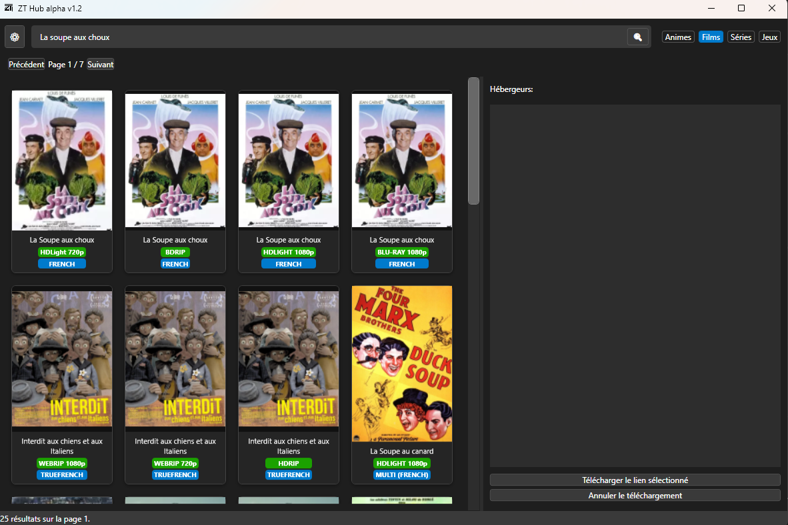

# ZT-Hub (Version C#)

ZT-Hub est une application de bureau Windows moderne qui offre une interface utilisateur intuitive et sans publicités pour interagir avec le site Zone-Téléchargement.

Cette version représente une **refonte complète du projet original**, migrant de Python vers **C# et le framework WPF (.NET)** pour des performances améliorées, une meilleure intégration avec Windows et une base de code plus robuste.

 

 

## Fonctionnalités

- **Interface utilisateur simple et épurée** développée en C# (WPF).
- **Accès direct** au contenu de Zone-Téléchargement, sans les distractions du site web.
- **Intégration avec AllDebrid** pour débrider les liens et permettre des téléchargements rapides et sécurisés.
- **Recherche par catégories** (Animes, Films, Séries, Jeux).
- **Navigation par pages** dans les résultats de recherche.
- **Gestionnaire de téléchargement** intégré avec barre de progression et vitesse en temps réel.

## Installation (pour les utilisateurs)

1.  Téléchargez la dernière version de l'application depuis la section [**Releases**](https://github.com/Seris-fr/ZT-Hub/releases) de ce dépôt.
2.  Décompressez l'archive téléchargée (ex: `ZT_Hub_vx.x.x.zip`).
3.  Lancez le fichier `ZTHub.exe`. Il n'y a pas d'installation requise.

## Configuration Initiale

1.  **Configuration DNS (Recommandé) :** Zone-Téléchargement est souvent bloqué par les FAI. Il est conseillé de configurer un DNS public comme [**1.1.1.1 (Cloudflare)**](https://one.one.one.one/fr-FR/dns/) sur votre connexion réseau pour contourner ce blocage.
2.  **Configuration de l'Application :**
    -   Après avoir lancé l'application, cliquez sur l'icône en forme d'engrenage (`⚙️`) en haut à gauche pour accéder aux paramètres.
    -   **URL de base :** L'URL par défaut est pré-configurée, mais vous pouvez la modifier si le domaine du site change.
    -   **Clé API AllDebrid :** Entrez votre clé API personnelle. Si vous n'en avez pas, vous pouvez en créer une sur votre compte premium [alldebrid.fr](https://alldebrid.fr) dans la section "APIKEYS".

## Utilisation

Une fois la clé API configurée, l'application est prête à l'emploi :
1.  Saisissez le nom d'une œuvre dans le champ de recherche.
2.  Choisissez la catégorie appropriée.
3.  Lancez la recherche.
4.  Sélectionnez un résultat dans la liste de gauche pour afficher les hébergeurs disponibles sur la droite.
5.  Choisissez un hébergeur, puis un lien de téléchargement et cliquez sur "Télécharger".

## Pour les Développeurs

Ce projet est développé en **C# 12** avec **.NET 9** et **WPF**. Si vous souhaitez contribuer, voici comment mettre en place l'environnement de développement.

### Prérequis

-   [**.NET 9 SDK**](https://dotnet.microsoft.com/download/dotnet/9.0) ou une version plus récente.
-   Un IDE compatible avec .NET, tel que :
    -   [**JetBrains Rider**](https://www.jetbrains.com/rider/) (recommandé)
    -   [**Visual Studio 2022**](https://visualstudio.microsoft.com/vs/) (avec "Développement .NET Desktop")

### Setup

1.  Clonez le dépôt sur votre machine locale :
    ```bash
    git clone https://github.com/Seris-fr/ZT-Hub.git
    ```
2.  Ouvrez le fichier `ZTHubApp.sln` avec Rider ou Visual Studio.
3.  L'IDE devrait automatiquement restaurer les dépendances NuGet nécessaires (comme `HtmlAgilityPack`).
4.  Vous pouvez maintenant compiler et lancer le projet en mode Débogage (`Debug`).

L'architecture du projet est organisée comme suit :
-   `/Models` : Classes de données (POCOs).
-   `/Views` : Fenêtres et contrôles utilisateur (XAML et code-behind).
-   `/Services` : Logique métier (appels réseau, parsing HTML, etc.).
-   `/Converters` : Convertisseurs de valeurs pour le binding WPF.
-   `/Resources` : Dictionnaires de ressources pour les styles globaux.

## Note Légale

Le téléchargement d'œuvres protégées par le droit d'auteur n'est légal que si vous possédez déjà une copie originale de l'œuvre. Veuillez vous assurer de respecter la législation en vigueur dans votre pays de résidence. Ce projet est fourni à des fins éducatives et ne saurait encourager le piratage.